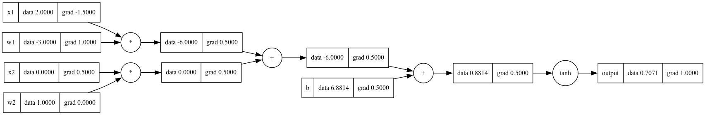

# Autograd.cpp



[Automatic Differentiation](https://en.wikipedia.org/wiki/Automatic_differentiation) is a technique to compute the derivative of a function programmatically and automatically, just by defining the calculation of the function itself. This makes it a powerful and essential cornerstone of modern machine learning frameworks, where the gradient of the loss function is required to optimize the model parameters.

Modern machine learning frameworks like TensorFlow, PyTorch, and JAX abstract the computation of the gradient away from the user to simplify the API. However, there is no better way to understand the inner workings of these frameworks than to implement the core functionality yourself. Which is what I did here. This exercise was influenced by the python implementation of [micrograd](https://github.com/karpathy/micrograd).

## Getting Started

### Prerequisites

- C compiler with C++17 support (e.g. [GCC](https://gcc.gnu.org/))
- [CMake](https://cmake.org/) >=3.14 (Technically optional, but recommended)
- Build system (e.g. [Make](https://www.gnu.org/software/make/))
- [Graphviz](https://graphviz.org/) (Optional, for visualizing the computation graph)

### Building

```bash
mkdir build
cd build
cmake ..
make
```

### Running the binary

```bash
# in the build directory
./main
```

### Running the tests

```bash
# in the build directory
ctest
```

## Usage

One thing to note in the implementation is that the library is designed to use pointers to `Value` objects. This means that when creating a new `Value` object, you should use the `create` static method instead of the constructor, which returns a shared pointer to the object. Other than that, the API is straightforward and fairly similar to PyTorch.

```cpp
auto a = Value::create(1.0);
auto b = Value::create(2.0);
auto c = Value::create(3.0);

auto f = a * b + c;

f->backward();

std::cout << "Gradient of f w.r.t. a: " << a->getGrad() << std::endl; // 2
```

### Example: Training a simple neural network

An example of using the library to train a simple neural network can be found in `main.cpp`. To use it, you first need to load the dataset using the `data/gen_data.py` script. This script loads and saves the moon dataset using the `sklearn.datasets.make_moons` function and saves it in a way the program in main can read without any additional effort. Requirements for the script are included in the `data/requirements.txt` file.

If you ever trained a neural network using PyTorch, the code should look familiar.

```cpp
auto dataset = DataLoader::load_dataset("../data/moon_dataset.csv");
auto [train_dataset, val_dataset] = DataLoader::train_test_split(dataset, 1.0, 0);

MLP model(2, {16, 16, 1}, false);

int EPOCHS = 500;
double LEARNING_RATE = 0.001;
int BATCH_SIZE = 1;
double epoch_loss = 0.0;
int training_batches = train_dataset.X.size() / BATCH_SIZE;

for (int i = 0; i < EPOCHS; i++)
{
    epoch_loss = 0.0;

    for (int j = 0; j < training_batches; j++)
    {
        std::vector<sample> batch_samples;
        for (int z = 0; z < BATCH_SIZE; z++)
        {
            batch_samples.push_back({train_dataset.X[j * BATCH_SIZE + z], train_dataset.y[j * BATCH_SIZE + z]});
        }

        // Forward pass
        std::vector<Value::ValuePtr> y_pred;
        for (auto &sample : batch_samples)
        {
            y_pred.push_back(model(sample.x)[0]);
        }
        Value::ValuePtr loss = Value::create(0.0);

        for (size_t z = 0; z < BATCH_SIZE; z++)
        {
            loss = loss + (y_pred[z] - Value::create(batch_samples[z].y))->pow(2);
        }

        // Backward pass
        model.zero_grad();
        loss->backward();
        epoch_loss += loss->getData();

        // Update parameters
        for (auto &param : model.parameters())
        {
            param->setData(param->getData() - LEARNING_RATE * param->getGrad());
        }
    }
}
```

***Important:*** As this is a basic implementation, the training process isn't optimized for stability or speed. This makes it highly prone to changes in the hyperparameters and initialization, or other problems such as vanishing/exploding gradients. Therefore, even if you encounter weird behavior when running the example, just running it again might give you better results. That being said, the provided example (using tanh activations) with the default hyperparameters should work fine.

### Tests

The library includes a test suite built with `gtest` that can be run using the `ctest` command. The tests cover the core functionality of the library with a focus on the `Value` class. A good practice, if anyone is interested, would be to reimplement the classes from scratch using tests as a guide.

## Classes

### `agrad/Value`

The `Value` class contains the core functionality of the autograd library. It represents a scalar value with the necessary methods to compute and store its gradient.

### `agrad/ValueGraph`

The `ValueGraph` class contains a static function for visualizing the computation graph of a given `Value` object. It uses the `graphviz` library to generate the graph. An example is provided in the `visualize.cpp` file.

### `data/DataLoader`

A simple data loader to make working with data easier during training.

### `nn/Module`

Base class for all neural network modules.

### `nn/Neuron`

A simple neuron class that can be used to build a neural network.

### `nn/Linear`

A linear layer of neurons.

### `nn/MLP`

A simple multi-layer perceptron of fully connected linear layers.
